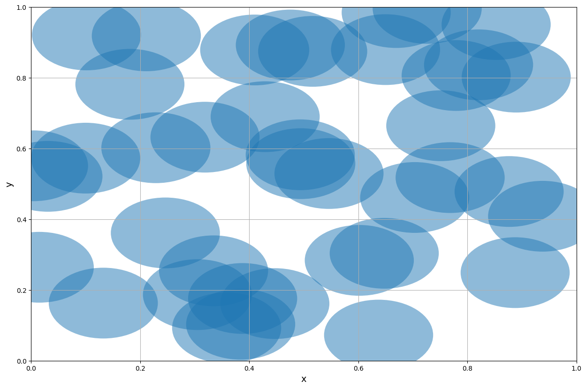
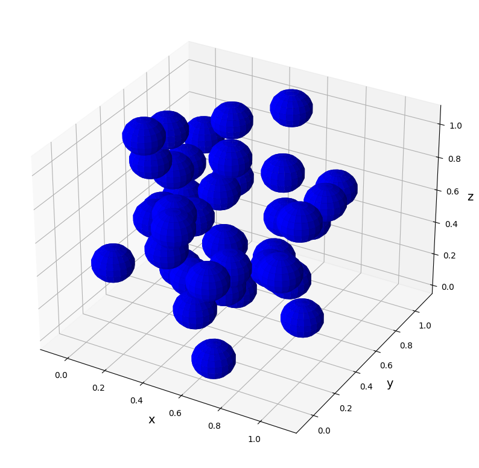

# Percolation Modelling (PM)


## Introduction
A percolation model was constructed using the Python programming language in order to investigate the percolation threshold for a two- and three-dimensional continuum model by examining several probability graphs created by the programme. Probability graphs were produced for various disk radii, and the percolation thresholds for a two- and three-dimensional continuum model were calculated. The results also indicated that there is a very sharp increase in the probability of forming a spanning cluster at the percolation threshold for a large system. We subsequently estimated the fraction of the total area occupied by the disks at the percolation threshold. 


## Requirements
Python 2.x is required to run the scripts (except for those with name beginning with 'ODE_').

Create an environment using conda as follows:
```bash
  conda create -n python2 python=2.x
```
Then activate the new environment by:
```bash
  conda activate python2
```

## Results



Figure 1: Two-dimensional model showing disks generated using the script provided. A spanning cluster is formed.

<br />



Figure 2: Three-dimensional model of Fig. 1.

<br />


Figure 3: Two-dimensional model showing disks generated using the script provided. No spanning clusters is formed.

<br />


Figure 4: Three-dimensional model of Fig. 3.


## 🔗 Links
[](https://www.linkedin.com/in/son-gyo-jung-655537135/)


## License
[](https://choosealicense.com/licenses/mit/)
